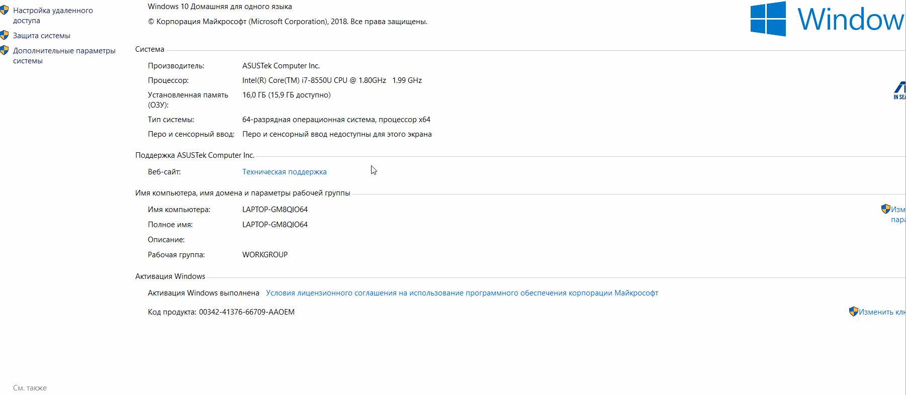
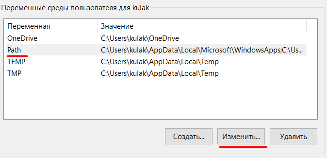
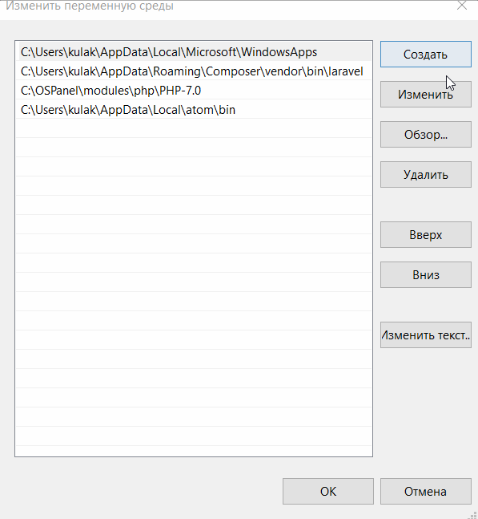
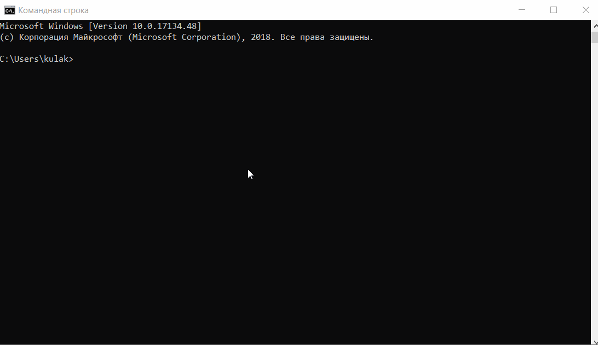

<h1> Инструкция по настройке рабочего пространства для комфортного обучения на курсе </h1>

<h2> Установка PHP </h2>

<ol>
    <li>
<a href="https://windows.php.net/download#php-7.2">Скачать</a> архив (Zip)   x86 — версия для 32-битной ОС, x64 — 64-битная версия. Из Thread Safe и Non Thread Safe выбираем Thread Safe (c поддержкой многопоточности).   
</li>
    <li>Чтобы установить PHP, просто распакуй скачанный архив в какую нибудь папку без пробелов в имени, например C:\PHP   Как должно выглядеть:     </li>
    <li>Добавить путь к этой папке в переменную окружения Path. Для этого:</li>
        <ul>
            <li>Открываем Панель управления->Система->Дополнительные параметры системы->Переменные среды    </li>
            <li>Выбераем переменную Path и нажимаем Изменить    </li>
            <li>И создаем путь к нашему распакованному архиву    </li>
        </ul>
    <li>Проверяем все ли правильно сделали:</li>
    <ul>
        <li>Открываем Командную строку</li>
        <li>Прописываем php -v</li>
    </ul>
</ol>

